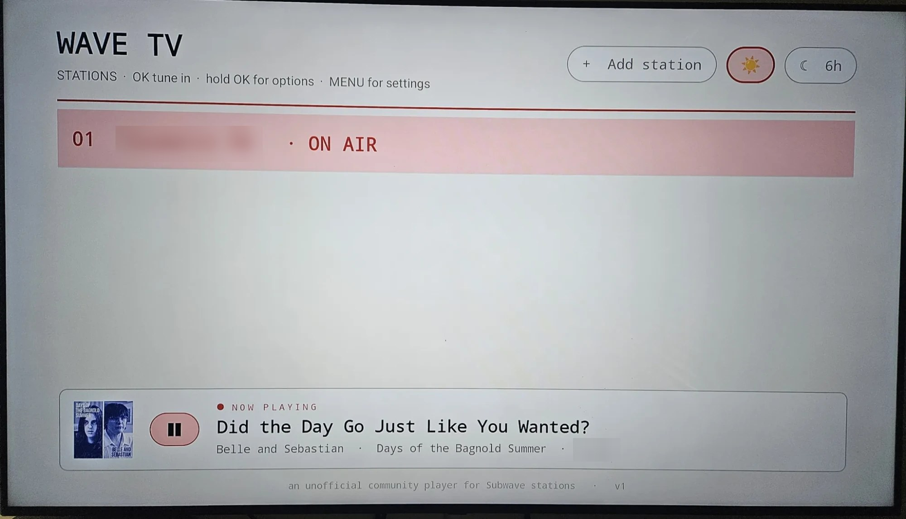
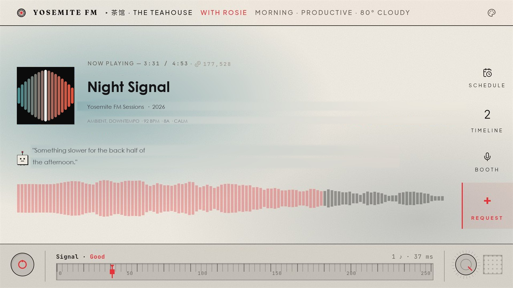
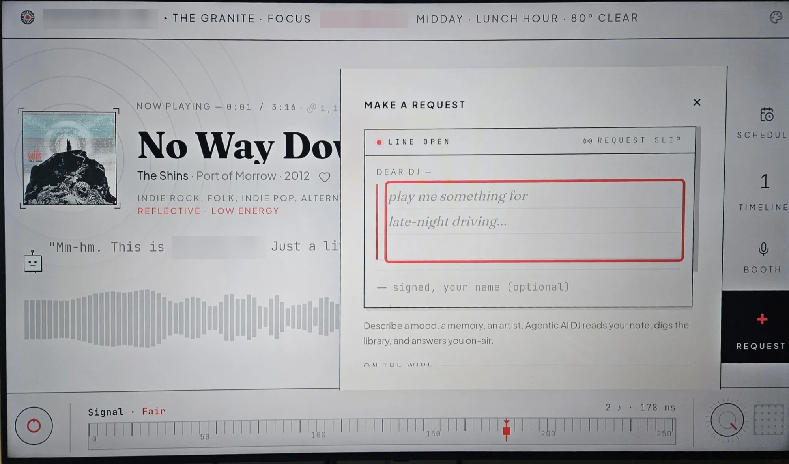

# Wave TV

**An Android TV and Fire TV player for [SUB/WAVE](https://github.com/perminder-klair/subwave)
stations.** A native station picker; selecting a station loads that station's
own web player fullscreen, driven by the remote. Skins, themes and artwork
render exactly as they do in a browser, because it *is* the browser player.

This is a shell, not a client. It implements no playback, no theming and no
station logic of its own — those belong to SUB/WAVE, and the app's job is to
put them on a television and make a D-pad work where a mouse is assumed. No
station is bundled; it ships empty.

Please note this was created with use of AI. It is an unofficial community
player, not an official SUB/WAVE release, and it is installed by sideloading —
review the source or build it yourself if that matters to you.

<table>
<tr>
<td width="33%"></td>
<td width="33%"></td>
<td width="33%"></td>
</tr>
<tr>
<td valign="top"><sub><b>The only screen the app draws.</b> Station list with now playing, cover art and transport, polled from the station's public API. Addresses are never displayed here. Station name redacted.</sub></td>
<td valign="top"><sub><b>Everything past the picker is SUB/WAVE's interface.</b> Masthead, waveform, commentary line, side rail and the operator's theme, unmodified. Wave TV contributes the focus navigation. Branding redacted.</sub></td>
<td valign="top"><sub><b>SUB/WAVE's request drawer, opened by remote.</b> Text arrives from the on-screen keyboard or from voice dictation. Branding redacted.</sub></td>
</tr>
</table>

## Features

**The picker**
- Add any number of stations by address; the name is optional and is adopted
  from the station itself when left blank.
- Now playing, cover art and a transport control, polled from the station's
  public API — no authentication required, even for private stations.
- Light, Dark, or Station theme, the last tinting the screen with the colours
  of whatever is currently on air.
- Addresses are deliberately not rendered on this screen, so a photograph of a
  television does not publish someone's LAN.

**In the player**
- D-pad spatial navigation across the page's real focusable controls, with a
  visible focus ring. Decorative targets — cover art, scrub bars, volume
  sliders, clock readouts — are excluded, so focus only lands where pressing OK
  does something.
- Song requests by remote, including voice dictation into the request slip.
- The soft keyboard opens on an explicit OK press and never on focus alone,
  which is what makes arrow-key navigation usable.
- The page renders at a 1280 px CSS viewport. Television pixel density
  otherwise selects each skin's mobile breakpoints, and the result is a phone
  layout stretched across a television.
- Sleep timer, one to six hours, armed whenever playback starts.

**Stations**
- `http://` and `https://` both permitted, so a station on the local network
  works without a certificate.
- Private stations are handled on both paths SUB/WAVE uses: the in-page
  members-only gate, and HTTP basic auth.
- A station that is down or unreachable returns to the picker rather than
  stranding the app on an error page.

## Install

Wave TV is distributed as a sideloaded APK. It is not on any store.

1. Download `WaveTV.apk` from [Releases](../../releases) and verify its SHA256
   against the value published there.

   ```
   certutil -hashfile WaveTV.apk SHA256      # Windows
   sha256sum WaveTV.apk                      # Linux
   ```

2. Enable sideloading:
   - **Google TV / Android TV** — Settings → System → About → press *Build*
     seven times, then Settings → System → Developer options → **USB debugging**
     or **Network debugging**.
   - **Fire TV** — Settings → My Fire TV → Developer options → **Apps from
     Unknown Sources**.

3. Transfer and install by any of:
   - `adb connect <tv-ip>` then `adb install WaveTV.apk`
   - the **Send Files to TV** app, which needs no computer
   - the **Downloader** app on Fire TV, pointed at a URL serving the APK

Requires Android 5.1 (API 22) or later. The television must be able to reach
any station added by LAN address.

## Adding a station

Select **+ Add station**, or Menu → Add. The address may be a LAN host such as
`192.168.1.50:7700` or a public one such as `radio.example.com`. Leave the name
blank to adopt the station's own.

## Remote controls

| Button | Action |
|---|---|
| D-pad | Move focus between the player's controls |
| OK / Select | Activate the focused control |
| Back | Close an open drawer; twice returns to the picker, audio continuing |
| Play/Pause | Toggle tune-in, or start voice dictation while a text field is focused |
| Stop | Mute and unmute |
| Menu | Voice request · Switch station · Reload · Exit |
| Search / mic | Voice request, where the remote routes that key to applications |

On the picker: **OK** tunes in, **long-press OK** offers Edit, Remove and
Forget saved password, **Menu** opens settings.

## Permissions and privacy

**One permission, `INTERNET`.** That is the whole manifest. No storage, no
microphone permission of its own — dictation is delegated to the system
recogniser, which prompts on its own behalf — no location, no accounts.

No analytics, no telemetry, no crash reporting, no advertising. Nothing is
transmitted anywhere except to the station selected. `allowBackup` is disabled,
so the station list is never copied off the device by the platform, and
uninstalling removes it.

## Passwords and your network

Stations may be private, which means a password may be typed into this app with
a remote. What that involves:

- **Saved basic-auth credentials are Base64-encoded, not encrypted.** Ticking
  *Remember on this device* writes them to the application's private storage.
  Encoding is not secrecy; it protects nothing from anyone with real access to
  the television. Leave it unticked, or clear it later with **long-press OK →
  Forget saved password**.
- **The members-only gate stores its password in the web player's
  `localStorage`**, exactly as a desktop browser would. The app does not
  intercept or copy it.
- **`http://` traffic is unencrypted**, including a password submitted to an
  `http://` station's login form. That is a reasonable trade on a private LAN
  and a poor one across the internet. Use `https://` for anything reachable
  from outside the network.
- Treat a hobby radio station as a place not to reuse an important password.

## Known limitations

- **The app is only as good as the page it loads.** Layout, playback and
  station behaviour are SUB/WAVE's; a change there can alter or break what
  appears here, and the fix belongs upstream.
- **No Chromecast or second-screen support.** Playback is local to the
  television.
- **Voice dictation depends on the remote and the device.** Where a
  manufacturer does not expose the recogniser to third-party applications, the
  on-screen keyboard is the only input.
- **Requires a WebView modern enough for the station's player.** Old or
  unpatched television firmware may render it poorly regardless of this app.
- **The station list is device-local.** Nothing syncs between televisions, and
  nothing survives an uninstall.
- **The build is Windows-only.** `build.ps1` is PowerShell and assumes an SDK
  at `C:\Android`.

## Building

```powershell
powershell -ExecutionPolicy Bypass -File build.ps1
```

Requires JDK 17 (Eclipse Adoptium) and an Android SDK at `C:\Android` with
`build-tools` and `platforms;android-35`. There is no Gradle; the script drives
`aapt2 → javac → d8 → zipalign → apksigner` directly and prints the SHA256 of
the result.

The first run generates a signing keystore, `wave-tv.jks`. Retain and back it
up — without it no future build can install over an existing copy. Its password
is read from `WAVETV_KEYSTORE_PASS` or prompted for; it is deliberately absent
from this repository, as are the keystore and the built APK.

## Layout

| Path | Contents |
|---|---|
| `app/AndroidManifest.xml` | Leanback manifest, `INTERNET` only, cleartext permitted for LAN stations |
| `app/java/com/wave/tv/MainActivity.java` | The application: picker, WebView shell, key handling, now-playing polling, speech-to-text |
| `app/assets/tvhelper.js` | Injected into the page — spatial navigation and the JavaScript ↔ native bridge |
| `app/res/` | Launcher icon, television banner, theme |

The package identifier is `com.wave.tv`. Earlier private builds used
`com.subwave.tv`; Android treats the two as separate applications, so an
earlier build must be uninstalled first and its station list will not carry
over.

## Licence

None chosen yet. Open an issue if a permissive licence would be useful.
