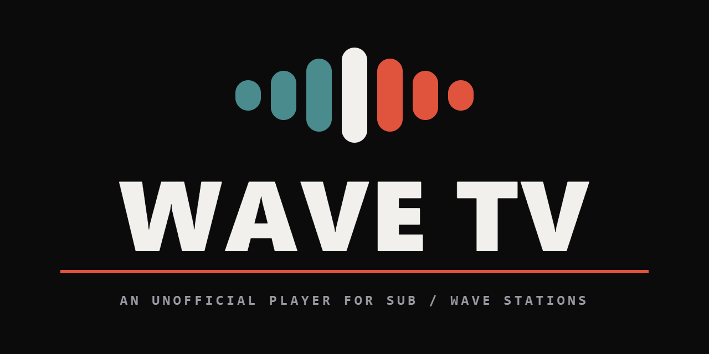
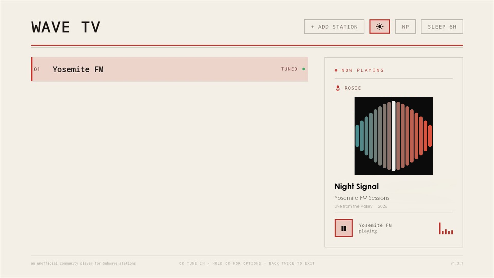
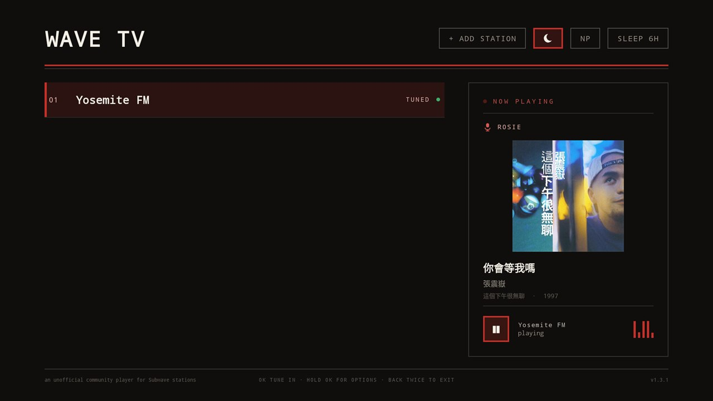
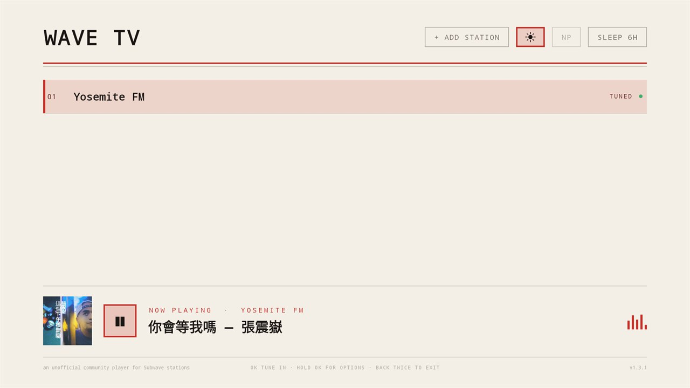
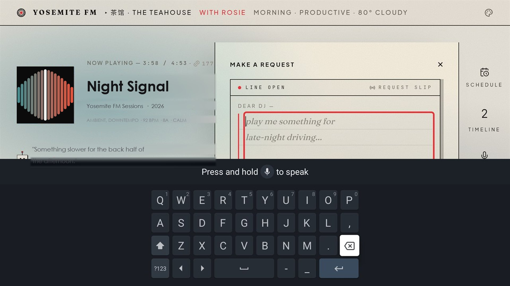

<p align="center">
  
</p>

# Wave TV

**An Android TV and Fire TV client for your own
[SUB/WAVE](https://github.com/perminder-klair/subwave) station** — enjoy your
personal station at home, or a public non-commercial station you have been
given the address of. A native station picker; selecting a station loads that
station's own web player fullscreen, driven by the remote. Skins, themes and
artwork render exactly as they do in a browser, because it *is* the browser
player.

This is a shell. It implements no playback, no theming and no station logic of
its own — those belong to SUB/WAVE, and the app's job is to put them on a
television and make a D-pad work where a mouse is assumed. No station is
bundled; it ships empty.

Please note this was created with use of AI. It is an unofficial community
player, not an official SUB/WAVE release — review the source or build it
yourself if that matters to you.

## What it plays

Nothing, until you tell it what to play. Wave TV carries no content and no
catalogue: there is no library, no directory, no search, no browse or
recommendation surface, and no station list fetched from anywhere. The list
starts empty and only ever holds addresses typed in on the device.

Those addresses are meant to be a [SUB/WAVE](https://github.com/perminder-klair/subwave)
server you run yourself, or a public non-commercial station whose operator has
given you the address — the same arrangement as a Plex, Jellyfin or Subsonic
client, where the server is somebody's own and this is only the screen in
front of it. SUB/WAVE is an internet *radio* server;
what a station broadcasts, and the rights to broadcast it, belong to whoever
operates that station.

In practice that most often means a server on your own home network. Wave TV
accepts a bare LAN address such as `192.168.1.50:7700`, and permits `http://`
as well as `https://` precisely so a machine sitting in your own house works
without a certificate — the traffic never leaves the building. Point it at the
SUB/WAVE server on your NAS or spare PC and it plays your own library, on your
own television, over your own network.

The app cannot fetch a file. It holds one Android permission, `INTERNET`, and
has no download code, no storage access and no handoff to any external
downloader — see [Permissions and privacy](#permissions-and-privacy). Once a
station is tuned, the player declines to navigate anywhere off that station's
own host, so it cannot be steered to a third-party site from inside a loaded
page.

<table>
<tr>
<td width="33%" valign="top">
<br />
<sub><b>The only screen the app draws.</b> The station list on the left, what is playing on the right — cover art, track, artist, album and the show on air, read from the station's public API. Addresses are never rendered here.</sub>
</td>
<td width="33%" valign="top">
<br />
<sub><b>Light, dark, or the station's own colours.</b> One button cycles them. In station mode the picker samples the loaded player's theme tokens and repaints to match whatever is on air.</sub>
</td>
<td width="33%" valign="top">
<br />
<sub><b>Minimal mode.</b> <code>NP</code> folds the panel down to a single strip and gives the list the full width. The level meter keeps moving only while sound is actually coming out.</sub>
</td>
</tr>
<tr>
<td width="33%" valign="top">
<br />
<sub><b>Everything past the picker is SUB/WAVE's interface.</b> Masthead, waveform, commentary line, side rail and the operator's theme, unmodified. Wave TV contributes the focus navigation and nothing else.</sub>
</td>
<td width="33%" valign="top">
<br />
<sub><b>The request drawer, opened by remote.</b> D-pad navigation lands on the page's real controls; decorative targets are skipped so focus only stops where pressing OK does something.</sub>
</td>
<td width="33%" valign="top">
<br />
<sub><b>Typing on a television.</b> OK on a focused field raises the keyboard against the real input; the set-top box's own press-and-hold-to-speak dictation works from there.</sub>
</td>
</tr>
</table>

## Features

**The picker**
- Add any number of stations by address; the name is optional and is adopted
  from the station itself when left blank.
- A full-height now-playing panel beside the list: cover art, track, artist,
  album, and the show or DJ on air where a station publishes one. Polled from
  the station's public API — no authentication required, even for private
  stations.
- A level meter that moves only while sound is actually coming out, so a glance
  says whether the stream is live or stalled.
- `NP` collapses the panel to a single strip and gives the list the full width.
- A station that is answering shows a green lamp; only the tuned station is
  labelled, and only a station that is not responding is spelled out.
- Light, Dark, or Station theme, the last tinting the screen with the colours
  of whatever is currently on air.
- Addresses are deliberately not rendered on this screen, so a photograph of a
  television does not publish someone's LAN.

**In the player**
- D-pad spatial navigation across the page's real focusable controls, with a
  visible focus ring. Decorative targets — cover art, scrub bars, volume
  sliders, clock readouts — are excluded, so focus only lands where pressing OK
  does something.
- Song requests by remote, including voice dictation into the request slip.
- The soft keyboard opens on an explicit OK press and never on focus alone,
  which is what makes arrow-key navigation usable.
- The page renders at a 1280 px CSS viewport. Television pixel density
  otherwise selects each skin's mobile breakpoints, and the result is a phone
  layout stretched across a television.
- Sleep timer, one to six hours, armed whenever playback starts.

**Stations**
- `http://` and `https://` both permitted, so a station on the local network
  works without a certificate.
- Private stations are handled on both paths SUB/WAVE uses: the in-page
  members-only gate, and HTTP basic auth.
- A station that is down or unreachable returns to the picker rather than
  stranding the app on an error page.

## Install

Wave TV is being published to the Google Play Store and the Amazon Appstore.
Install it from the store on your television — search for **Wave TV**, or open
the listing on the device:

| Store | Device |
|---|---|
| Google Play | Android TV and Google TV |
| Amazon Appstore | Fire TV |

Store links will be added here once each listing is live.

Requires Android 5.1 (API 22) or later. The television must be able to reach
whichever SUB/WAVE server you add, including one on your own network.

Building from source is covered under [Building](#building), and is the
supported route for anyone who would rather compile it themselves than take a
store binary.

## Adding a station

Select **+ Add station**, or Menu → Add. The address may be a LAN host such as
`192.168.1.50:7700` or a public one such as `radio.example.com`. Leave the name
blank to adopt the station's own.

## Remote controls

| Button | Action |
|---|---|
| D-pad | Move focus between the player's controls |
| OK / Select | Activate the focused control |
| **Hold OK** | Voice request · Sleep timer · Switch station · Reload · Exit |
| Back | Close an open drawer; twice returns to the picker, audio continuing |
| Play/Pause | Toggle tune-in, or start voice dictation while a text field is focused |
| Stop | Mute and unmute |
| Menu | The same menu as holding OK, on remotes that have the button |
| Search / mic | Voice request, where the remote routes that key to applications |

**Nothing is reachable only by Menu.** Not every television remote has that
button — the Google TV Streamer's has none at all — so in the player, holding
OK opens the same menu.

On the picker: **OK** tunes in, **holding OK** on a station offers Edit, Remove
and Forget saved password, and **Back twice** exits. Adding a station, the
theme, the now-playing panel and the sleep timer are the four buttons along the
top of the screen, so nothing there needs a Menu button either.

## Permissions and privacy

**One permission, `INTERNET`.** That is the whole manifest. No storage, no
microphone permission of its own — dictation is delegated to the system
recogniser, which prompts on its own behalf — no location, no accounts.

No analytics, no telemetry, no crash reporting, no advertising. Nothing is
transmitted anywhere except to the station selected. `allowBackup` is disabled,
so the station list is never copied off the device by the platform, and
uninstalling removes it.

## Passwords and your network

Stations may be private, which means a password may be typed into this app with
a remote. What that involves:

- **Saved basic-auth credentials are Base64-encoded, not encrypted.** Ticking
  *Remember on this device* writes them to the application's private storage.
  Encoding is not secrecy; it protects nothing from anyone with real access to
  the television. Leave it unticked, or clear it later with **long-press OK →
  Forget saved password**.
- **The members-only gate stores its password in the web player's
  `localStorage`**, exactly as a desktop browser would. The app does not
  intercept or copy it.
- **`http://` traffic is unencrypted**, including a password submitted to an
  `http://` station's login form. That is a reasonable trade on a private LAN
  and a poor one across the internet. Use `https://` for anything reachable
  from outside the network.
- **Only the tuned station is ever asked for, or told, a password.** A page can
  provoke an authentication prompt, and this app's own prompt is a convincing
  thing to be shown. Any challenge that comes from a host other than the
  station is refused rather than answered, a saved credential is never replayed
  to anything else, and a request carrying one will not follow a redirect.
- Treat a hobby radio station as a place not to reuse an important password.

## Known limitations

- **The app is only as good as the page it loads.** Layout, playback and
  station behaviour are SUB/WAVE's; a change there can alter or break what
  appears here, and the fix belongs upstream.
- **No Chromecast or second-screen support.** Playback is local to the
  television.
- **Links out of the station don't open.** The player stays on the host you
  tuned; a link to somewhere else is declined rather than followed. There is no
  browser here to hand it to, and everything the shell grants the page — the
  native bridge, autoplay, a saved password — is granted to that station alone.
- **Voice dictation depends on the remote and the device.** Where a
  manufacturer does not expose the recogniser to third-party applications, the
  on-screen keyboard is the only input.
- **Requires a WebView modern enough for the station's player.** Old or
  unpatched television firmware may render it poorly regardless of this app.
- **The station list is device-local.** Nothing syncs between televisions, and
  nothing survives an uninstall.
- **The build is Windows-only.** `build.ps1` is PowerShell and assumes an SDK
  at `C:\Android`.

## Building

```powershell
powershell -ExecutionPolicy Bypass -File build.ps1
```

Requires JDK 17 (Eclipse Adoptium) and an Android SDK at `C:\Android` with
`build-tools` and `platforms;android-35`. There is no Gradle; the script drives
`aapt2 → javac → d8 → zipalign → apksigner` directly and prints the SHA256 of
the result.

The first run generates a signing keystore, `wave-tv.jks`. Retain and back it
up — without it no future build can install over an existing copy. Its password
is read from `WAVETV_KEYSTORE_PASS` or prompted for; it is deliberately absent
from this repository, as are the keystore and the built APK.

## Layout

| Path | Contents |
|---|---|
| `app/AndroidManifest.xml` | Leanback manifest, `INTERNET` only, cleartext permitted for LAN stations |
| `app/java/com/wave/tv/MainActivity.java` | The screen: picker, WebView shell, key handling, now-playing polling, speech-to-text |
| `app/java/com/wave/tv/StationStore.java` | What survives the process — the station list, the last-played pointer, saved passwords, address validation |
| `app/java/com/wave/tv/Http.java` | Calls to a station's public API: timeouts, credentials, bounded reads, cover decoding |
| `app/java/com/wave/tv/Palette.java` | The picker's colour scheme, and reading a station's own theme tokens |
| `app/java/com/wave/tv/Colors.java` | Wave TV's ink, and the contrast arithmetic that keeps a station's theme readable |
| `app/java/com/wave/tv/ThemeGlyph.java` | The sun / moon / broadcast marks on the theme toggle |
| `app/java/com/wave/tv/MicGlyph.java` | The studio mic that marks the show/DJ line |
| `app/java/com/wave/tv/LevelMeter.java` | The five-bar meter beside the transport |
| `app/java/com/wave/tv/Station.java` | One entry in the picker: a name and an address |
| `app/assets/tvhelper.js` | Injected into the page — spatial navigation and the JavaScript ↔ native bridge |
| `app/res/` | Launcher icon (flat and adaptive), television banner, theme |
| `art/` | Vector sources for the mark, and the GitHub social preview |

The package identifier is `com.wave.tv`. Earlier private builds used
`com.subwave.tv`; Android treats the two as separate applications, so an
earlier build must be uninstalled first and its station list will not carry
over.

## Content and rights

Wave TV supplies no content, and no way to obtain any. It has no catalogue, no
directory, no search and no download capability; it connects to the address of
a SUB/WAVE server you enter, and does nothing else. On first launch it is
empty.

It is meant for a station you run yourself, or one whose operator has given you
access — playing material you own, material you have licensed, or material
that is free to broadcast. Private stations are supported precisely because a
station is often somebody's own and not meant for the public.

Whoever operates a station is responsible for what it broadcasts and for
holding the rights to broadcast it. This project supplies none of those rights
and cannot verify them.

This project does not condone, support or assist copyright infringement, and
the app is not built in a way that would help: there is no search or
directory to find infringing streams, no download or recording capability to
capture them, and no way to reach any host other than the station you tuned.
Using it to infringe works against its design and gets no help from it.

## Licence

[MIT](LICENSE). Use it, change it, ship your own build — just keep the notice
with it. There is no warranty of any kind.

SUB/WAVE itself is a separate project under its own licence; nothing here
grants you anything in respect of it.
